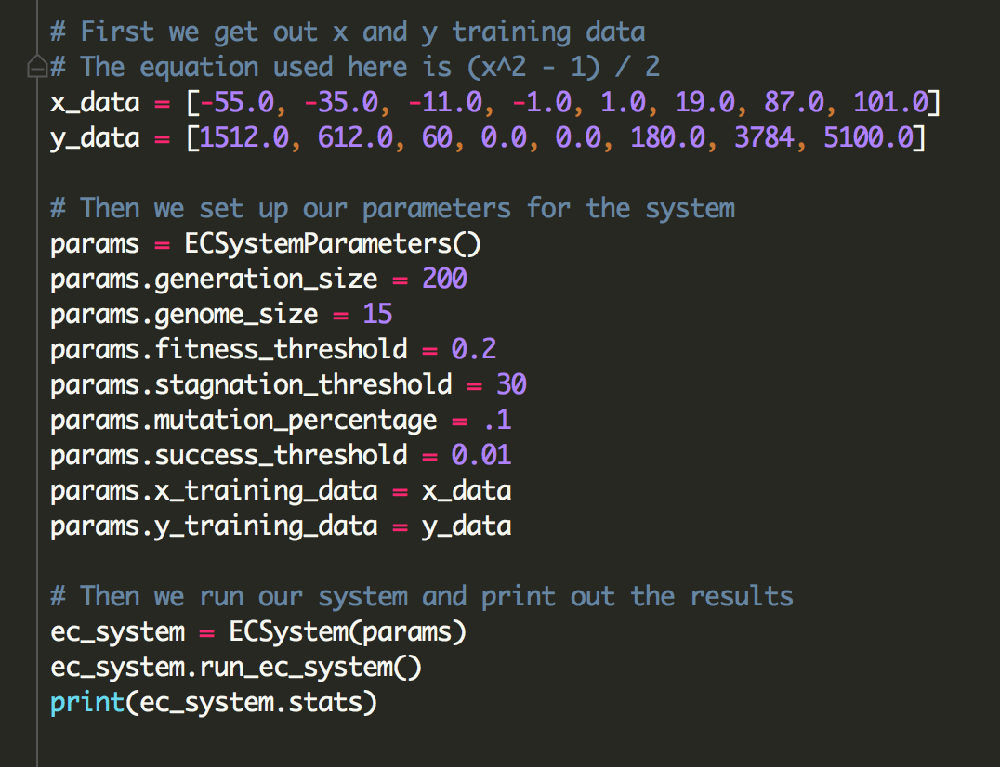

# EVOLUTIONARY COMPUTING PROJECT (PYTHON)
This program is able to generate an equivalent expression to a given set of x and y coordinates.

## Program Sample

## About This Project
### Origin
This project was initially written in Java for a class project (details on that project can be seen [here](https://github.com/rossweinstein/Evolutionary-Computing-Java)).  This exercise was about seeing what it would be like to rewrite a program in a different language.

### Functionality
To run this Evolutionary Computing System, you need to first set up a few parameters first.

* Generation size => Governs the number of expressions in each generation
* Genome size => Governs the length of the expressions in the initial population
* Training Data => The x and y values used to evalute an expression's fitness
* Fitness Threshold => The percentage of the population selected for the next generation
* Stagnation Threshold => If our fitness is not improving over this set number of generations, the EC System reboots
* Mutation Percentage => Governs the ratio of expressions crossed to expressions mutated
* Success Threshold => Defines the minimum fitness value required for the system to deem the expression equivalent

Once all parameters are set, you are ready to go.

## Outside Code
To evaluate the string expressions in the Evolutionary Computing System I used [py-expression-eval](https://github.com/Axiacore/py-expression-eval) by Axiacore.

