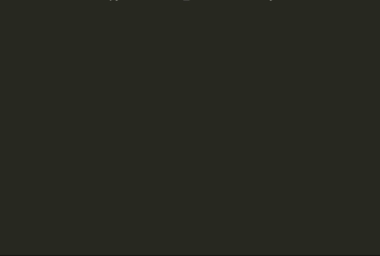

# EVOLUTIONARY COMPUTING PROJECT (PYTHON)
This program is able to generate an equivalent expression to a given set of x and y coordinates.

## Program Sample

## About This Project
### Origin
This project was initially written in Java for a class project (details on that project can be seen [here](https://github.com/rossweinstein/Evolutionary-Computing-Java)).  This exercise was about seeing what it would be like to rewrite a program in a different language.

### Functionality
To run this Evolutionary Computing System, you need to first set up a few parameters first.

* Generation size => How many expressions do we have in each generation
* Genome size => How long can the expressions be in the initial population
* X-Training Data => The x value we will plug into our random expressions
* Y-Training Data => The y values we will match our output to to determine fitness
* Fitness Threshold => What percentage of the population will be selected to go on to the next generation
* Stagnation Threshold => If our fitness is not improving over this set number of generations, we reboot the system
* Mutation Percentage => Of the Individuals selected for the next generation, what percentage will we mutate
* Success Threshold => Define how close to the trainging data the generate expressions needs to be in order to be considered a success.
  
Once all parameters are set, you may pass them to the ECSystem and you are ready to go.

## Outside Code
To evaluate the string expressions in the Evolutionary Computing System I used [py-expression-eval](https://github.com/Axiacore/py-expression-eval) by Axiacore.

